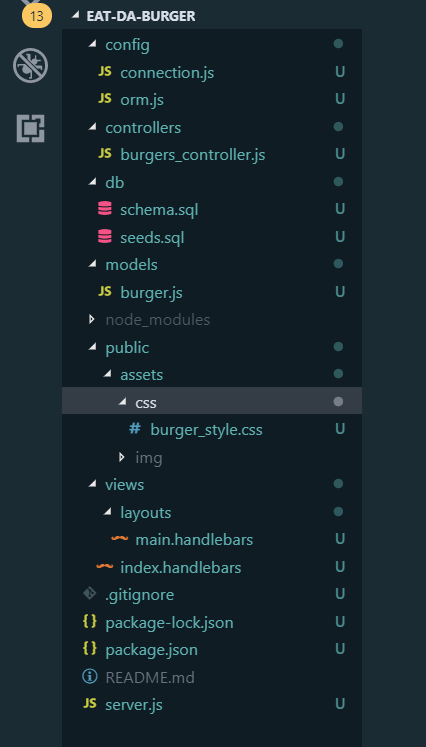

<h1><strong>Eat-Da-Burger</h1>

<h2>Overview</h2>

Eat-Da-Burger! is a restaurant app that lets users input the names of burgers they'd like to eat. 

Whenever a user submits a burger's name, your app will display the burger on the left side of the page -- waiting to be devoured.

Each burger in the waiting area also has a Devour it! button. When the user clicks it, the burger will move to the right side of the page.

Your app will store every burger in a database, whether devoured or not.

<h2><strong><em>Burger Dicrectory Structure</em></strong></h3>

<h2>Build with</h2>
<ul>
<li>My SQL
<li>Node
<li>Express
<li>Handlebars
<li>MVC Design pattern
<li>CSS3/ jQuery/ JavaScript
<li>Deployed in Heroku
